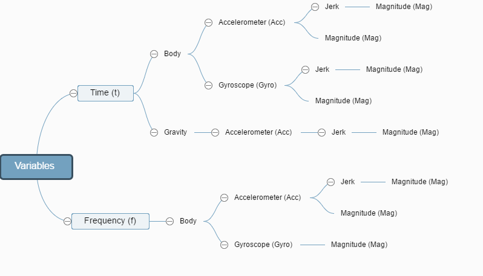

# CodeBook
###1.Data
The `tidyData.csv` is a `180x68` dataset with `68` variables and `180` observations (the average of each variable for each activity and each subject) extracted from [UCI Human Activity Recognition](http://archive.ics.uci.edu/ml/datasets/Human+Activity+Recognition+Using+Smartphones) dataset.

###2.Variables
The `4th` step of analysis requires to name variables instead of reshaping the dataset. The cost of reshaping the dataset is high and will introduce too many NAs into the dataset.The current dataset is good enough for generate further reseaches with a few adjustments. Therefore, I named the variables according to the feature_info.txt and features.txt and drew a simple mind map to help readers to better understand the naming method.  
    

*  **1.signals from experiments[1:66]**
    + -1-1
* Structure of descriptive variable names
    + the `1st` level: Domain
        + Time (**t**)
        + Frequency (**f**)
    + the `2nd` level: Type of accelerate signals
        + **Body**
        + **Gravity**
    + the `3rd` level: Equipments
        + Accelerometer (**Acc**)
        + Gyroscope (**Gyro**)
    + the `4th` level: 
        + **Jerk**
        + Magnitude (**Mag**): the magnitude of these three-dimensional signals were calculated using the Euclidean norm.

* Naming Method:
    + Every signal name at least contains the first 3 levels.    
    + Every signal name contains three-dimensional signals (tBodyAcc.XYZ, tGravityAcc.XYZ) except the magnitude(Mag).   
    + Mean and standard deviation (std) are added as suffix of to identify different estimations of signals.  

* The list of signals variables  
 [1] "tBodyAcc.mean.X"          
 [2] "tBodyAcc.mean.Y"          
 [3] "tBodyAcc.mean.Z"          
 [4] "tBodyAcc.std.X"           
 [5] "tBodyAcc.std.Y"           
 [6] "tBodyAcc.std.Z"           
 [7] "tGravityAcc.mean.X"       
 [8] "tGravityAcc.mean.Y"       
 [9] "tGravityAcc.mean.Z"       
[10] "tGravityAcc.std.X"        
[11] "tGravityAcc.std.Y"        
[12] "tGravityAcc.std.Z"        
[13] "tBodyAccJerk.mean.X"      
[14] "tBodyAccJerk.mean.Y"      
[15] "tBodyAccJerk.mean.Z"      
[16] "tBodyAccJerk.std.X"       
[17] "tBodyAccJerk.std.Y"       
[18] "tBodyAccJerk.std.Z"       
[19] "tBodyGyro.mean.X"         
[20] "tBodyGyro.mean.Y"         
[21] "tBodyGyro.mean.Z"         
[22] "tBodyGyro.std.X"          
[23] "tBodyGyro.std.Y"          
[24] "tBodyGyro.std.Z"          
[25] "tBodyGyroJerk.mean.X"     
[26] "tBodyGyroJerk.mean.Y"     
[27] "tBodyGyroJerk.mean.Z"     
[28] "tBodyGyroJerk.std.X"      
[29] "tBodyGyroJerk.std.Y"      
[30] "tBodyGyroJerk.std.Z"      
[31] "tBodyAccMag.mean"         
[32] "tBodyAccMag.std"          
[33] "tGravityAccMag.mean"      
[34] "tGravityAccMag.std"       
[35] "tBodyAccJerkMag.mean"     
[36] "tBodyAccJerkMag.std"      
[37] "tBodyGyroMag.mean"        
[38] "tBodyGyroMag.std"         
[39] "tBodyGyroJerkMag.mean"    
[40] "tBodyGyroJerkMag.std"     
[41] "fBodyAcc.mean.X"          
[42] "fBodyAcc.mean.Y"          
[43] "fBodyAcc.mean.Z"          
[44] "fBodyAcc.std.X"           
[45] "fBodyAcc.std.Y"           
[46] "fBodyAcc.std.Z"           
[47] "fBodyAccJerk.mean.X"      
[48] "fBodyAccJerk.mean.Y"      
[49] "fBodyAccJerk.mean.Z"      
[50] "fBodyAccJerk.std.X"       
[51] "fBodyAccJerk.std.Y"       
[52] "fBodyAccJerk.std.Z"       
[53] "fBodyGyro.mean.X"         
[54] "fBodyGyro.mean.Y"         
[55] "fBodyGyro.mean.Z"         
[56] "fBodyGyro.std.X"          
[57] "fBodyGyro.std.Y"          
[58] "fBodyGyro.std.Z"          
[59] "fBodyAccMag.mean"         
[60] "fBodyAccMag.std"           
[61] "fBodyBodyAccJerkMag.mean"   
[62] "fBodyBodyAccJerkMag.std"     
[63] "fBodyBodyGyroMag.mean"      
[64] "fBodyBodyGyroMag.std"       
[65] "fBodyBodyGyroJerkMag.mean"  
[66] "fBodyBodyGyroJerkMag.std"   

*  **2.subject[67]**: the subject who performed the activity.  
    + 1-30  

*  **3.label[68]**: the types of activities  
    + Walking  
    + WalkingUp: walking upstairs  
    + WalkingDown: walking downstairs  
    + Sitting  
    + Standing   
    + Laying  
    
###3.Transformations
####1).Merges the training and the test sets to create one data set.

```r
library(data.table)
File = "dataset.Rdata" # Existed .Rdata
# Load data using data.table package
if(!file.exists(File)){
    features <- fread("./UCI HAR Dataset/features.txt")
    
    train <- fread("./UCI HAR Dataset/train/X_train.txt")
    test <- fread("./UCI HAR Dataset/test/X_test.txt")
    
    label.train <- read.table("./UCI HAR Dataset/train/y_train.txt", colClasses = "factor")
    label.test <- read.table("./UCI HAR Dataset/test/y_test.txt", colClasses = "factor")
    
    subject.train <- read.table("./UCI HAR Dataset/train/subject_train.txt", colClasses = "factor")
    subject.test <- read.table("./UCI HAR Dataset/test/subject_test.txt", colClasses = "factor")
}
load(File)
label <- rbind(label.train, label.test)
subject <- rbind(subject.train, subject.test)
names(label) <- "label"
names(subject) <- "subject"
# Merge training and testing data
dat <- rbind(train, test)
dat <- data.frame(dat, subject, label)
```

####2).Extracts only the measurements on the mean and standard deviation for each measurement.

```r
# Extract variables' names with mean() and std()
num.mean.std.meanFreq <- grep("mean|std", features$V2) #79
num.meanFreq <- grep("meanFreq",features$V2) #66
num.mean.std <- num.mean.std.meanFreq[which(match(num.mean.std.meanFreq, num.meanFreq, nomatch = 0) == 0)]
dat.mean.std <- dat[, c(num.mean.std, 562, 563)] #68
```

####3).Uses descriptive activity names to name the activities in the data set

```r
levels(dat.mean.std$label) <- c("Walking", "WalkingUp", "WalkingDown", "Sitting", "Standing", "Laying")
```

####4).Appropriately labels the data set with descriptive variable names.

```r
feature.new <- features$V2[num.mean.std]
feature.new <- gsub("[()]", "", feature.new)
feature.new <- make.names(feature.new)
colnames(dat.mean.std) <- c(feature.new, "subject", "label")  
```

####5).From the data set in step 4, creates a second, independent tidy data set 

```r
# With the average of each variable for each activity and each subject.
dat.mean.std.copy <- dat.mean.std
levels(dat.mean.std.copy$label) <- c(1,2,3,4,5,6)
dat.mean.std.copy$label <- as.numeric(dat.mean.std.copy$label)
dat.mean.std.copy$subject <- as.numeric(dat.mean.std.copy$subject)
dat.mean.std.g <- split(dat.mean.std.copy, c(label, subject))

# Calculate the average of each variable for each activity and each subject
myData <- as.data.frame(t(sapply(dat.mean.std.g, colMeans))) 
rownames(myData) <- 1:180
myData$label <- as.factor(myData$label)
levels(myData$label) <- c("Walking", "WalkingUp", "WalkingDown", "Sitting", "Standing", "Laying")
write.csv(myData, file = "tidyData.csv")
```

