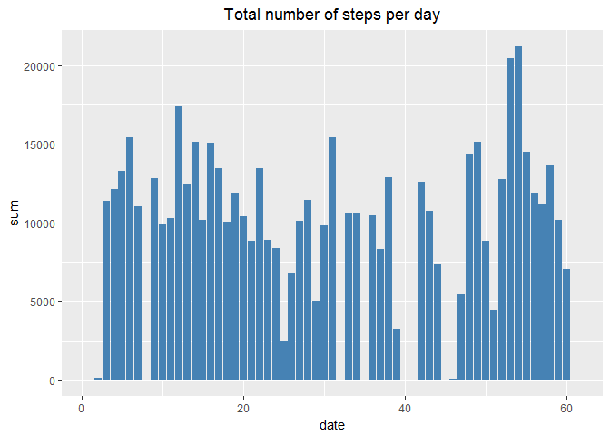
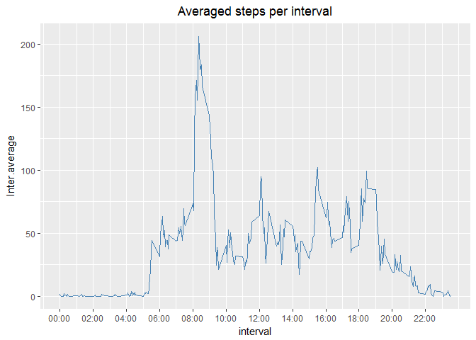
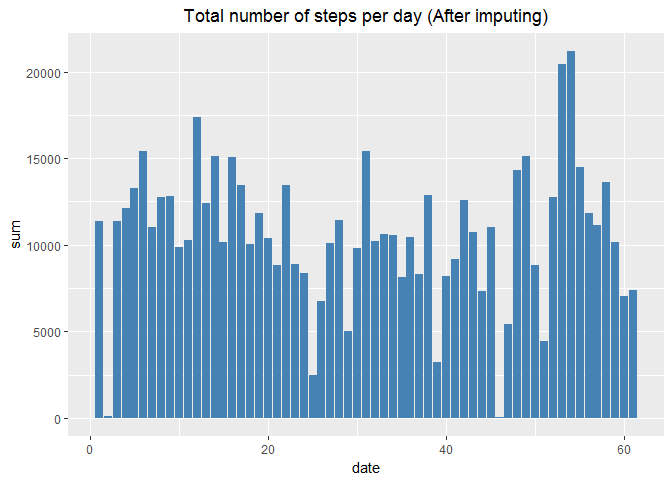
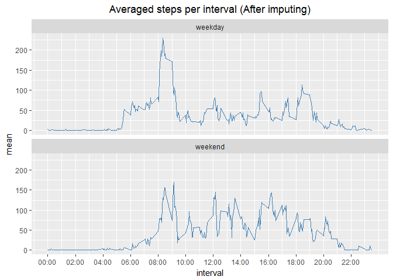

# Reproducible Research: Peer Assessment 1
##Loading and preprocessing the data
In order to choose working directory properly, I use `choose.dir()`to choose directory interactively.

```r
path <- choose.dir()
setwd(path)
library(dplyr)
act <- read.csv("activity.csv")
```

##What is mean total number of steps taken per day?

```r
sum.sum <- act %>%
           group_by(date) %>%
           summarise("sum" = sum(steps, na.rm = T))
sum.sum$date <- 1:nrow(sum.sum)

library(ggplot2)
ggplot(sum.sum, aes(date, sum)) + 
    geom_bar(stat = "identity", fill = "steelblue") + #Using two variables from data frame to draw histogram 
    ggtitle("Total number of steps per day") +
    theme(plot.title = element_text(hjust = 0.5)) #R 3.3.2 cannot center the title automatically
```




```r
mean(sum.sum$sum)
```

```
[1] 9354.23
```

```r
median(sum.sum$sum)
```

```
[1] 10395
```
The **mean** total number of steps taken per day: `9354.23`.  
The **median** total number of steps taken per day: `10395`.

##What is the average daily activity pattern?
1. Averaged steps per interval

```r
inter.Mean <- act %>%
              group_by(interval) %>%
              summarise("Inter.average" = mean(steps, na.rm = T))
ggplot(inter.Mean, aes(interval, Inter.average)) +
    geom_line(color = "steelblue") + 
    ggtitle("Averaged steps per interval") +
    theme(plot.title = element_text(hjust = 0.5)) +  #R 3.3.2 cannot center the title automatically
    scale_x_continuous(breaks = c(0, 200, 400, 600, 800, 1000, 1200, 1400, 1600, 1800, 2000, 2200),
                       labels = c("00:00", "02:00", "04:00", "06:00", "08:00", "10:00", "12:00", 
                                  "14:00", "16:00", "18:00", "20:00", "22:00"))
```



2. The inverval with the maximum number of steps

```r
maximum <- max(inter.Mean$Inter.average)
Max <- inter.Mean$interval[which(inter.Mean$Inter.average==maximum)] %>% 
       sprintf(fmt = "%04d") %>% #835 -> 0835
       strptime(format = "%H%M") %>% #Convert to the standard time
       format(format = "%H:%M")
maximum
```

```
[1] 206.1698
```

```r
Max
```

```
[1] "08:35"
```
The `08:35` 5-minute interval, on average across all the days in the dataset, contains the maximum number of steps, `206.1698`.

##Imputing missing values
1. Calculate the total number of missing values in dataset

```r
colSums(is.na(act))
```

```
   steps     date interval 
    2304        0        0 
```
There are `2304` NAs in the column **step**.

2. Imput missing values using kNN (k-NearestNeighbor)  
In order to imput missing values, I use kNN through loading `DMwR` package.

```r
library(DMwR)
act.knn <- knnImputation(act)
colSums(is.na(act.knn))
```

```
   steps     date interval 
       0        0        0 
```

```r
summary(act.knn)
```

```
     steps                date          interval     
 Min.   :  0.00   2012-10-01:  288   Min.   :   0.0  
 1st Qu.:  0.00   2012-10-02:  288   1st Qu.: 588.8  
 Median :  0.00   2012-10-03:  288   Median :1177.5  
 Mean   : 36.94   2012-10-04:  288   Mean   :1177.5  
 3rd Qu.: 19.20   2012-10-05:  288   3rd Qu.:1766.2  
 Max.   :806.00   2012-10-06:  288   Max.   :2355.0  
                  (Other)   :15840                   
```
After imputing, there is no NA in the dataset.

3. Total number of steps taken per day (after imputing)

```r
sum.knn.sum <- act.knn %>%
               group_by(date) %>%
               summarise("sum" = sum(steps, na.rm = T))
sum.knn.sum$date <- 1:nrow(sum.knn.sum)
ggplot(sum.knn.sum, aes(date, sum)) + 
    geom_bar(stat = "identity", fill = "steelblue") +
    ggtitle("Total number of steps per day (After imputing)") +
    theme(plot.title = element_text(hjust = 0.5)) #R 3.3.2 cannot center the title automatically
```




```r
mean(sum.knn.sum$sum)
```

```
[1] 10637.85
```

```r
median(sum.knn.sum$sum)
```

```
[1] 10600
```
The **mean** total number of steps taken per day (after imputing): `10637.85`  

The **median** total number of steps taken per day (after imputing): `10600`

The values of **mean** and **median** increase after imputing missing data.

##Are there differences in activity patterns between weekdays and weekends?

```r
lct <- Sys.setlocale("LC_TIME", "C")#Set the language using by R to English instead of using default language
#Label weekends and weekdays
act.knn.dtype <- act.knn %>%
                mutate(type = weekdays(as.Date(date), abbreviate = T)) %>%
                mutate(level = ifelse(type == "Sat" | type == "Sun", "weekend", "weekday"))
act.knn.dtype.g <- group_by(act.knn.dtype, level, interval)%>%
                    summarise("mean"= mean(steps)) 
ggplot(act.knn.dtype.g, aes(interval, mean)) + 
    geom_line(color = "steelblue") + 
    facet_wrap(~level, nrow = 2) +
    ggtitle("Averaged steps per interval (After imputing)") +
    theme(plot.title = element_text(hjust = 0.5)) +
    scale_x_continuous(breaks = c(0, 200, 400, 600, 800, 1000, 1200, 1400, 1600, 1800, 2000, 2200),
                       labels = c("00:00", "02:00", "04:00", "06:00", "08:00", "10:00", "12:00", 
                                  "14:00", "16:00", "18:00", "20:00", "22:00"))
```


