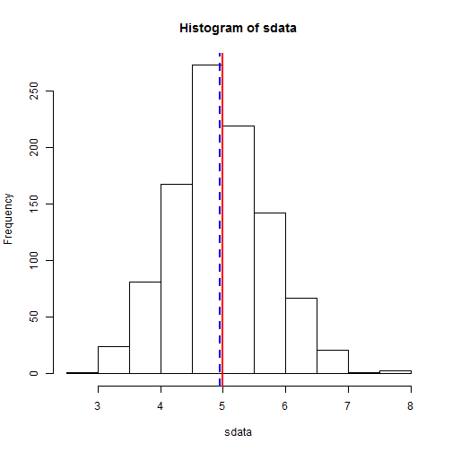
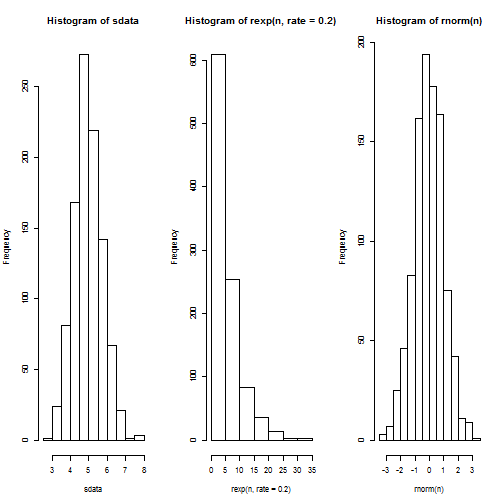

##1.Simulation Exercise

```r
library(ggplot2)
library(plotly)
set.seed(309)
n <- 1000
sdata <- NULL
for (i in 1 : n) sdata = c(sdata, mean(rexp(40, 0.2)))
hist(sdata)
#Theoretical Mean
abline(v = 5, lty = 1, lwd = 2, col = "red")
#Sample Mean
abline(v = mean(sdata), lwd = 2, lty = 2, col = "blue")
```



```r
#Sample variance
var(sdata)
```

```
[1] 0.5830309
```

```r
#Campare with Normal Distribution
par(mfcol = c(1, 3))
hist(sdata)
hist(rexp(n, rate  = 0.2))
hist(rnorm(n))
```


##2.Basic Inferential Data Analysis

```r
data("ToothGrowth")
summary(ToothGrowth)
```

```
      len        supp         dose      
 Min.   : 4.20   OJ:30   Min.   :0.500  
 1st Qu.:13.07   VC:30   1st Qu.:0.500  
 Median :19.25           Median :1.000  
 Mean   :18.81           Mean   :1.167  
 3rd Qu.:25.27           3rd Qu.:2.000  
 Max.   :33.90           Max.   :2.000  
```

```r
ToothGrowth$supp <- as.factor(ToothGrowth$supp)
ToothGrowth$dose <- as.factor(ToothGrowth$dose)
g <- ggplot(ToothGrowth, aes(x = dose, y = len, color = supp)) +
    geom_point() +
    labs(color = "Supplyment")
ggplotly(g)
```

```
Error in loadNamespace(name): there is no package called 'webshot'
```

```r
#Confidence interval by Supplement type(supp)
sub_s_1 <- subset(ToothGrowth, dose == 0.5)
sub_s_2 <- subset(ToothGrowth, dose == 1)
sub_s_3 <- subset(ToothGrowth, dose == 2)
rbind(
    t.test(len ~ supp, paired = F, var.equal = F, data = sub_s_1)$conf,
    t.test(len ~ supp, paired = F, var.equal = F, data = sub_s_2)$conf,
    t.test(len ~ supp, paired = F, var.equal = F, data = sub_s_3)$conf
)
```

```
          [,1]     [,2]
[1,]  1.719057 8.780943
[2,]  2.802148 9.057852
[3,] -3.798070 3.638070
```

```r
#Confidence interval by Dose in milligrams/day
# ToothGrowth_1 <- mutate(ToothGrowth, id = 1:nrow(ToothGrowth))
# wideTG <- dcast(ToothGrowth_1, id + supp ~ dose, value.var = "len")
sub_d_1 <- subset(ToothGrowth, supp == "OJ" & dose == c(0.5,1))
sub_d_2 <- subset(ToothGrowth, supp == "OJ" & dose == c(0.5,2))
sub_d_3 <- subset(ToothGrowth, supp == "OJ" & dose == c(1,2))

sub_d_4 <- subset(ToothGrowth, supp == "VC" & dose == c(0.5,1))
sub_d_5 <- subset(ToothGrowth, supp == "VC" & dose == c(0.5,2))
sub_d_6 <- subset(ToothGrowth, supp == "VC" & dose == c(1,2))

rbind(
    t.test(len ~ dose, paired = F, var.equal = F, sub_d_1)$conf,
    t.test(len ~ dose, paired = F, var.equal = F, sub_d_2)$conf,
    t.test(len ~ dose, paired = F, var.equal = F, sub_d_3)$conf,
    t.test(len ~ dose, paired = F, var.equal = F, sub_d_4)$conf,
    t.test(len ~ dose, paired = F, var.equal = F, sub_d_5)$conf,
    t.test(len ~ dose, paired = F, var.equal = F, sub_d_6)$conf
)
```

```
          [,1]        [,2]
[1,] -14.94689  -5.6131139
[2,] -16.94335  -7.0966531
[3,] -11.23644  -0.1635575
[4,] -12.65876  -6.0612410
[5,] -25.62861 -11.6513937
[6,] -15.32237  -1.0376276
```

